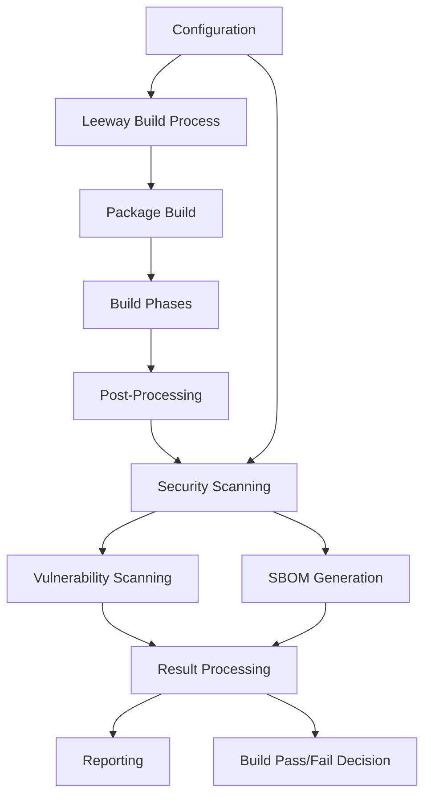

# Leeway Security Scanning and SBOM Generation: Technical Implementation Plan

## Overview

This document provides a detailed technical implementation plan for integrating vulnerability scanning and Software Bill of Materials (SBOM) generation into the Leeway build tool. It builds upon the high-level approach outlined in the [cve_sbom.md](./cve_sbom.md) document, focusing on the technical details of the implementation.

## Architecture

### Core Components

The implementation consists of the following core components:

1. **Configuration System**: Extensions to the existing Leeway configuration system to support security scanning options
2. **Security Scanner Interface**: A pluggable interface for different security scanning tools
3. **SBOM Generator**: Functionality to generate SBOMs for different package types
4. **Build Process Integration**: Hooks into the Leeway build process to trigger scanning
5. **Result Handling**: Processing and reporting of scanning results

### Component Diagram



## Configuration System

### Workspace Configuration

The security scanning configuration will be added to the `WORKSPACE.yaml` file with the following structure:

```yaml
# In WORKSPACE.yaml
security:
  enabled: true
  sbom:
    enabled: true
    format: "cyclonedx-json" # Options: "cyclonedx-json", "spdx-json", "spdx-tag-value"
  vulnerabilityScanning:
    enabled: true
    failOnSeverity: "CRITICAL" # Options: "CRITICAL", "HIGH", "MEDIUM", "LOW", "NONE"
    ignorePath: ".trivyignore.yaml" # Path to ignore file relative to workspace root
```

### Package Configuration

Individual packages can override workspace-level settings:

```yaml
# In BUILD.yaml
packages:
  - name: example
    type: go
    config:
      security:
        enabled: true
        sbom:
          enabled: true
        vulnerabilityScanning:
          enabled: true
          failOnSeverity: "HIGH"
```

### Configuration Loading

The configuration will be loaded through the existing Leeway configuration system:

1. Parse workspace-level configuration from `WORKSPACE.yaml`
2. Parse package-level configuration from `BUILD.yaml`
3. Merge configurations with package-level settings taking precedence
4. Validate configuration values

## Security Scanner Interface

### Scanner Interface

The security scanner interface will be defined as follows:

```go
// SecurityScanner defines the interface for security scanning tools
type SecurityScanner interface {
    // ScanPackage scans a package for vulnerabilities and generates SBOM
    ScanPackage(ctx *buildContext, pkg *Package, buildDir string) (*SecurityScanResult, error)
    
    // Name returns the name of the scanner
    Name() string
    
    // Version returns the version of the scanner
    Version() string
}

// SecurityScanResult contains the results of a security scan
type SecurityScanResult struct {
    // Vulnerabilities found during scanning
    Vulnerabilities []Vulnerability
    
    // SBOM data generated during scanning
    SBOM []byte
    
    // SBOMFormat indicates the format of the SBOM data
    SBOMFormat string
    
    // RawOutput contains the raw output from the scanner
    RawOutput string
}

// Vulnerability represents a security vulnerability found during scanning
type Vulnerability struct {
    // ID is the vulnerability identifier (e.g., CVE-2021-44228)
    ID string
    
    // Severity is the severity level of the vulnerability
    Severity VulnerabilitySeverity
    
    // Package is the affected package
    Package string
    
    // Version is the affected version
    Version string
    
    // FixedVersion is the version that fixes the vulnerability
    FixedVersion string
    
    // Description is a human-readable description of the vulnerability
    Description string
    
    // References contains links to more information about the vulnerability
    References []string
}

// VulnerabilitySeverity represents the severity level of a vulnerability
type VulnerabilitySeverity string

const (
    SeverityCritical VulnerabilitySeverity = "CRITICAL"
    SeverityHigh     VulnerabilitySeverity = "HIGH"
    SeverityMedium   VulnerabilitySeverity = "MEDIUM"
    SeverityLow      VulnerabilitySeverity = "LOW"
    SeverityUnknown  VulnerabilitySeverity = "UNKNOWN"
)
```

### Trivy Scanner Implementation

The initial implementation will use Trivy as the security scanner:

```go
// TrivyScanner implements the SecurityScanner interface using Trivy
type TrivyScanner struct {
    // Configuration for the Trivy scanner
    Config TrivyConfig
}

// TrivyConfig contains configuration options for the Trivy scanner
type TrivyConfig struct {
    // Path to the Trivy executable
    Path string
    
    // Severity levels to scan for
    Severity string
    
    // IgnorePath is the path to the ignore file
    IgnorePath string
    
    // SBOMFormat is the format to use for SBOM generation
    SBOMFormat string
}

// ScanPackage implements the SecurityScanner interface
func (s *TrivyScanner) ScanPackage(ctx *buildContext, pkg *Package, buildDir string) (*SecurityScanResult, error) {
    // Implementation details for scanning with Trivy
    // ...
}
```

## SBOM Generation

### SBOM Generation Process

The SBOM generation process will vary based on package type:

1. **Docker Packages**: Use Trivy to scan the built image
2. **Go Packages**: Use Trivy to scan the source code and dependencies
3. **Yarn Packages**: Use Trivy to scan the node_modules directory
4. **Generic Packages**: Use Trivy to scan the build directory

### SBOM Storage

The generated SBOM will be:

1. Stored alongside the build artifacts
2. Included in the package provenance information
3. Available for retrieval through the Leeway CLI

## Build Process Integration

### Integration Points

The security scanning will be integrated into the Leeway build process at the following points:

1. **Post-Build Processing**: After all build phases but before packaging
2. **Package Registration**: When registering newly built packages

### Implementation in build.go

The implementation will modify the `build` function in `pkg/leeway/build.go`:

```go
func (p *Package) build(buildctx *buildContext) error {
    // Existing build code...
    
    // After all build phases but before packaging
    if (p.C.W.Security.Enabled || p.Security.Enabled) && bld.SecurityScan != nil {
        log.WithField("package", p.FullName()).Debug("running security scan")
        if err := bld.SecurityScan(buildctx, p, builddir); err != nil {
            return xerrors.Errorf("security scan failed: %w", err)
        }
    }
    
    // Continue with packaging and registration...
}
```

### Security Scanning Function

The `SecurityScan` function will be implemented in `pkg/leeway/security.go`:

```go
// RunSecurityScan performs security scanning on a package
func RunSecurityScan(buildCtx *buildContext, pkg *Package, buildDir string) error {
    // Get security configuration
    config := getSecurityConfig(pkg)
    if !config.Enabled {
        return nil
    }
    
    // Create scanner based on configuration
    scanner, err := createScanner(config)
    if err != nil {
        return xerrors.Errorf("failed to create security scanner: %w", err)
    }
    
    // Run the scan
    result, err := scanner.ScanPackage(buildCtx, pkg, buildDir)
    if err != nil {
        return xerrors.Errorf("security scan failed: %w", err)
    }
    
    // Process results
    if err := processSecurityResults(buildCtx, pkg, result, config); err != nil {
        return xerrors.Errorf("failed to process security results: %w", err)
    }
    
    return nil
}
```

## Package Type-Specific Implementations

### Docker Packages

For Docker packages, the security scanning will:

1. Scan the built image using Trivy
2. Generate an SBOM for the image
3. Store the results alongside the image metadata

Implementation details:

```go
func scanDockerPackage(buildCtx *buildContext, pkg *Package, buildDir string, scanner SecurityScanner) (*SecurityScanResult, error) {
    // Get the image name from the package configuration
    cfg, ok := pkg.Config.(DockerPkgConfig)
    if !ok {
        return nil, xerrors.Errorf("package should have Docker config")
    }
    
    // Get the image version
    version, err := pkg.Version()
    if err != nil {
        return nil, err
    }
    
    // Scan the image
    result, err := scanner.ScanPackage(buildCtx, pkg, buildDir)
    if err != nil {
        return nil, err
    }
    
    // Store the SBOM alongside the image metadata
    if result.SBOM != nil {
        sbomPath := filepath.Join(buildDir, "sbom.json")
        if err := os.WriteFile(sbomPath, result.SBOM, 0644); err != nil {
            return nil, xerrors.Errorf("failed to write SBOM: %w", err)
        }
    }
    
    return result, nil
}
```

### Go Packages

For Go packages, the security scanning will:

1. Scan the source code and dependencies using Trivy
2. Generate an SBOM for the package
3. Store the results alongside the package artifacts

Implementation details:

```go
func scanGoPackage(buildCtx *buildContext, pkg *Package, buildDir string, scanner SecurityScanner) (*SecurityScanResult, error) {
    // Scan the package
    result, err := scanner.ScanPackage(buildCtx, pkg, buildDir)
    if err != nil {
        return nil, err
    }
    
    // Store the SBOM alongside the package artifacts
    if result.SBOM != nil {
        sbomPath := filepath.Join(buildDir, "sbom.json")
        if err := os.WriteFile(sbomPath, result.SBOM, 0644); err != nil {
            return nil, xerrors.Errorf("failed to write SBOM: %w", err)
        }
    }
    
    return result, nil
}
```

### Yarn Packages

For Yarn packages, the security scanning will:

1. Scan the node_modules directory using Trivy
2. Generate an SBOM for the package
3. Store the results alongside the package artifacts

Implementation details:

```go
func scanYarnPackage(buildCtx *buildContext, pkg *Package, buildDir string, scanner SecurityScanner) (*SecurityScanResult, error) {
    // Scan the package
    result, err := scanner.ScanPackage(buildCtx, pkg, buildDir)
    if err != nil {
        return nil, err
    }
    
    // Store the SBOM alongside the package artifacts
    if result.SBOM != nil {
        sbomPath := filepath.Join(buildDir, "sbom.json")
        if err := os.WriteFile(sbomPath, result.SBOM, 0644); err != nil {
            return nil, xerrors.Errorf("failed to write SBOM: %w", err)
        }
    }
    
    return result, nil
}
```

## Result Handling

### Result Processing

The security scan results will be processed as follows:

1. Check for vulnerabilities that exceed the configured severity threshold
2. Fail the build if required by configuration
3. Store the SBOM and vulnerability information with the build artifacts
4. Report the results to the user

Implementation details:

```go
func processSecurityResults(buildCtx *buildContext, pkg *Package, result *SecurityScanResult, config SecurityConfig) error {
    // Check for vulnerabilities that exceed the threshold
    failBuild := false
    for _, vuln := range result.Vulnerabilities {
        if severityExceedsThreshold(vuln.Severity, config.VulnerabilityScanning.FailOnSeverity) {
            log.WithFields(log.Fields{
                "package":    pkg.FullName(),
                "id":         vuln.ID,
                "severity":   vuln.Severity,
                "component":  vuln.Package,
                "version":    vuln.Version,
                "fixVersion": vuln.FixedVersion,
            }).Error("Security vulnerability found")
            failBuild = true
        }
    }
    
    // Fail the build if required
    if failBuild && config.VulnerabilityScanning.FailOnSeverity != "NONE" {
        return xerrors.Errorf("security vulnerabilities found that exceed the configured threshold")
    }
    
    // Store the SBOM with the build artifacts
    if result.SBOM != nil && config.SBOM.Enabled {
        sbomPath := filepath.Join(buildCtx.BuildDir(), fmt.Sprintf("%s.sbom.%s", pkg.FilesystemSafeName(), config.SBOM.Format))
        if err := os.WriteFile(sbomPath, result.SBOM, 0644); err != nil {
            return xerrors.Errorf("failed to write SBOM: %w", err)
        }
    }
    
    return nil
}
```

### Reporting

The security scan results will be reported to the user through:

1. Console output during the build
2. Build artifacts containing the full scan results
3. Integration with the Leeway CLI for retrieving results

## CLI Extensions

### New Commands

The Leeway CLI will be extended with new commands for security scanning:

1. `leeway security scan`: Scan a package for vulnerabilities
2. `leeway security sbom`: Generate an SBOM for a package
3. `leeway security show`: Show security information for a package

Implementation details:

```go
// In cmd/security.go
var securityCmd = &cobra.Command{
    Use:   "security",
    Short: "Security scanning and SBOM generation",
    Long:  "Commands for security scanning and SBOM generation",
}

var securityScanCmd = &cobra.Command{
    Use:   "scan [package]",
    Short: "Scan a package for vulnerabilities",
    Long:  "Scan a package for vulnerabilities using the configured security scanner",
    Run: func(cmd *cobra.Command, args []string) {
        // Implementation details
    },
}

var securitySBOMCmd = &cobra.Command{
    Use:   "sbom [package]",
    Short: "Generate an SBOM for a package",
    Long:  "Generate a Software Bill of Materials (SBOM) for a package",
    Run: func(cmd *cobra.Command, args []string) {
        // Implementation details
    },
}

var securityShowCmd = &cobra.Command{
    Use:   "show [package]",
    Short: "Show security information for a package",
    Long:  "Show security information for a package, including vulnerabilities and SBOM",
    Run: func(cmd *cobra.Command, args []string) {
        // Implementation details
    },
}
```

## Trivy Integration

### Trivy Execution

The Trivy scanner will be executed as follows:

1. Check if Trivy is installed
2. Execute Trivy with the appropriate arguments
3. Parse the Trivy output

Implementation details:

```go
func executeTrivyCommand(args []string, workDir string) ([]byte, error) {
    // Check if Trivy is installed
    trivyPath, err := exec.LookPath("trivy")
    if err != nil {
        return nil, xerrors.Errorf("trivy not found in PATH: %w", err)
    }
    
    // Create command
    cmd := exec.Command(trivyPath, args...)
    cmd.Dir = workDir
    
    // Execute command
    output, err := cmd.CombinedOutput()
    if err != nil {
        return nil, xerrors.Errorf("trivy execution failed: %w\nOutput: %s", err, string(output))
    }
    
    return output, nil
}
```

### Trivy Configuration

The Trivy scanner will be configured based on the package type:

1. **Docker Packages**: Scan the image with `trivy image`
2. **Go Packages**: Scan the filesystem with `trivy fs`
3. **Yarn Packages**: Scan the filesystem with `trivy fs`
4. **Generic Packages**: Scan the filesystem with `trivy fs`

Implementation details:

```go
func getTrivyArgs(pkg *Package, buildDir string, config SecurityConfig) []string {
    args := []string{}
    
    // Add common arguments
    args = append(args, "--format", "json")
    
    // Add severity filter
    if config.VulnerabilityScanning.Enabled {
        args = append(args, "--severity", config.VulnerabilityScanning.Severity)
    }
    
    // Add ignore file if specified
    if config.VulnerabilityScanning.IgnorePath != "" {
        args = append(args, "--ignorefile", config.VulnerabilityScanning.IgnorePath)
    }
    
    // Add SBOM generation if enabled
    if config.SBOM.Enabled {
        args = append(args, "--format", config.SBOM.Format)
    }
    
    // Add package-specific arguments
    switch pkg.Type {
    case DockerPackage:
        // Get image name from package configuration
        cfg, ok := pkg.Config.(DockerPkgConfig)
        if !ok {
            return nil
        }
        
        // Get image version
        version, err := pkg.Version()
        if err != nil {
            return nil
        }
        
        args = append(args, "image", version)
    case GoPackage, YarnPackage, GenericPackage:
        args = append(args, "fs", buildDir)
    }
    
    return args
}
```

## Implementation Timeline

### Phase 1: Core Infrastructure (2 weeks)

1. **Week 1**:
   - Implement configuration system
   - Define security scanner interface
   - Create basic Trivy scanner implementation

2. **Week 2**:
   - Integrate with build process
   - Implement result handling
   - Add basic CLI commands

### Phase 2: Package Type Support (2 weeks)

1. **Week 3**:
   - Implement Docker package scanning
   - Implement Go package scanning

2. **Week 4**:
   - Implement Yarn package scanning
   - Implement Generic package scanning
   - Add comprehensive testing

### Phase 3: Refinement and Documentation (1 week)

1. **Week 5**:
   - Refine error handling and reporting
   - Add comprehensive documentation
   - Create examples and tutorials

## Testing Strategy

### Unit Tests

Unit tests will be created for:

1. Configuration parsing and validation
2. Security scanner interface
3. Result processing and reporting

### Integration Tests

Integration tests will be created for:

1. End-to-end build process with security scanning
2. CLI commands
3. Different package types

### Test Cases

1. **Basic Functionality**:
   - Verify that security scanning can be enabled/disabled
   - Verify that SBOM generation can be enabled/disabled
   - Verify that vulnerability scanning can be enabled/disabled

2. **Configuration**:
   - Verify that workspace-level configuration works
   - Verify that package-level configuration overrides workspace-level configuration
   - Verify that configuration validation works

3. **Scanning**:
   - Verify that Docker packages are scanned correctly
   - Verify that Go packages are scanned correctly
   - Verify that Yarn packages are scanned correctly
   - Verify that Generic packages are scanned correctly

4. **Result Handling**:
   - Verify that vulnerabilities are reported correctly
   - Verify that the build fails when vulnerabilities exceed the threshold
   - Verify that SBOMs are generated and stored correctly

## Conclusion

This technical implementation plan provides a detailed roadmap for integrating security scanning and SBOM generation into the Leeway build tool. By following this plan, we can enhance Leeway's security capabilities while maintaining compatibility with existing workflows.

The implementation leverages the existing Leeway architecture and build process, adding security scanning as a natural extension rather than a separate system. This approach ensures that security scanning becomes an integral part of the build process, making it easier for developers to adopt and use.

The phased implementation approach allows for incremental delivery of value, with each phase building on the previous one. This approach reduces risk and allows for feedback and refinement throughout the implementation process.
